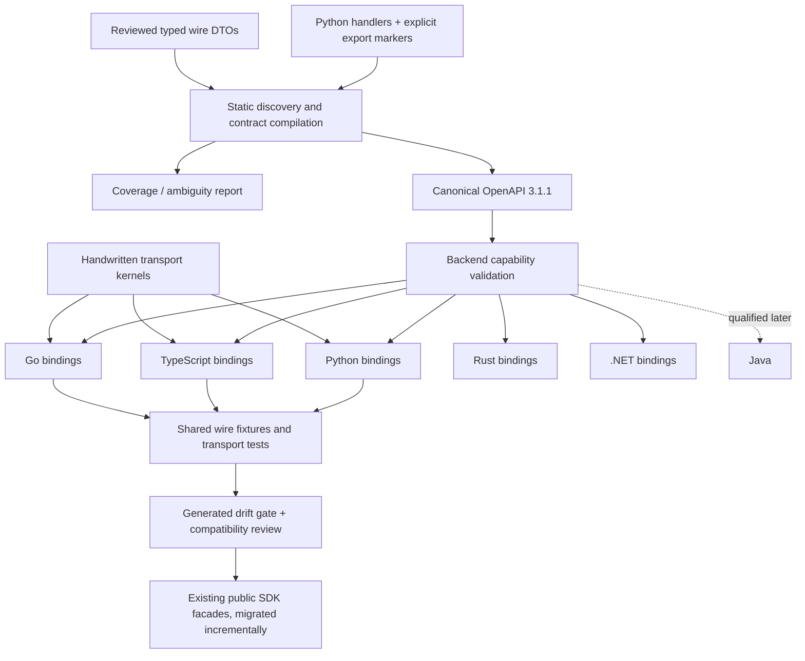

# Deterministic Headroom SDK generation

**Status:** proposed architecture plus executable, experimental CCR pilot. Not a replacement SDK or a merge-readiness claim.

**Reviewed baseline:** `headroomlabs-ai/headroom@c46e74d06b5ffa9643f420f28d2da6686fb7e487`.
**Motivating contribution:** PR #405, `pacifio/headroom@2851cbc964ac24d51e825361d23c857f671ffb8f`.

## Decision

Make the Python server's explicitly exported **wire contract** the source of truth. Harvest it without starting the proxy, compile a normalized OpenAPI 3.1.1 document, and generate language-specific models and endpoint bindings from that document. Keep HTTP policy and ergonomic SDK behavior in small, separately tested, handwritten layers.

Do not generate a new SDK by translating an existing SDK. Do not assume every public Python symbol is remotely callable. In-process compression engines, callbacks, provider adapters, and local context managers require separate bindings or handwritten integrations; a JSON schema cannot reproduce their implementation.



The intermediate representation is OpenAPI itself, not a second proprietary schema maintained alongside OpenAPI. `x-headroom-*` extensions describe visibility and retry policy. Backend adapters must preserve or explicitly reject those semantics. OpenAPI 3.1.1 is a deliberate compatibility target, not a claim that it is the latest specification.

## Why this is needed now

PR #405 copies a substantial surface into Go: wire structures, endpoints, error handling, retry/fallback policy, adapters, streaming, and convenience logic. Those layers change for different reasons. A server-owned schema can keep endpoint paths, parameters, return fields, and nullability aligned. It cannot by itself decide whether a compression failure should fall back to the original messages or whether a cancelled provider request may be replayed.

The current server also has raw `Request` handlers and dictionary returns. For example, `/v1/compress` delegates to `proxy.handle_compress(request)` without declaring a response model. Ordinary FastAPI OpenAPI export will not discover the complete request and response contract in that implementation. A heuristic that looks at `.get()` calls or sample JSON is not a trustworthy replacement: it misses branches, optional fields, dynamic payloads, and middleware behavior.

CCR retrieval supplies a useful bounded pilot. Both `POST /v1/retrieve` and `GET /v1/retrieve/{hash_key}` return seven stable fields. `tool_name` is required in the response but its value can be null. Retrieval is hash-only and returns full original content. The POST is loopback/same-origin guarded; the GET is loopback guarded. Those restrictions must not disappear just because a client can be generated.

## Source contract and harvesting

### Explicit export, not accidental exposure

A build-time marker identifies reviewed operations:

```python
@app.post(
    "/v1/retrieve",
    dependencies=[Depends(_require_loopback), Depends(_require_same_origin)],
)
@sdk_operation(
    operation_id="retrieve",
    request=RetrieveRequest,
    response=RetrieveResponse,
    access="loopback-same-origin",
    errors={400: RetrievalError, 404: RetrievalError},
)
async def ccr_retrieve(request: Request): ...  # existing body unchanged
```

`@sdk_operation` returns the exact same function object. It does not wrap the handler, register routes, validate bodies, alter annotations, or set FastAPI's `response_model`. This is intentional: adding a return annotation alone can change FastAPI response validation and filtering. The generation proposal must not silently change production behavior as a side effect of adding metadata.

The compiler reads Python ASTs, not imported runtime objects. Its input list is explicit in `sdk/codegen/config.json`. It never starts background tasks, imports the proxy, loads models, reads credentials, or calls providers. The fixture deliberately raises on import; the compiler still processes it successfully.

### Type adapters

The implemented adapter handles direct, unambiguous `TypedDict` declarations, required/optional keys, nullable values, scalar types, homogeneous `Literal` enums, lists, string-keyed maps, and an explicitly intentional `JsonValue`. Qualified aliases, inheritance, recursive models, arbitrary unions, untyped `Any`, unsupported route parameters, and streaming response classes are rejected rather than weakened into permissive types.

The request DTO is a reviewed declaration of the supported client input, not an inferred proof of everything the raw server happens to accept. For example, the client sends a string hash, while the current raw handler only checks truthiness before using it. This pilot adds no server-side validation and does not claim to formalize every malformed request the server might accept or reject.

Future adapters should support Pydantic validation/serialization schemas and selected dataclasses. They must account for aliases, validators, serializers, computed fields, discriminated unions, and direction-specific request versus response behavior. Import-based Pydantic extraction must occur in a pinned, isolated build environment. Do not add a fallback that imports the full application when AST extraction fails.

### Surface accounting

`inventory` scans route decorators, including non-exported and hidden routes, and reports dynamic registrations such as `include_router`, `mount`, and `add_api_route`. This is a static candidate inventory, **not a complete runtime route graph**. Every production route eventually needs a disposition: exported native API, provider pass-through, local administrative API, internal-only, or deferred with an owner and reason.

The delivered compiler rejects bad exported operations, but does not yet enforce a repository-wide classification ledger. `inventory --strict` is available for a bounded, fully classified source set; enabling it for the entire current repository is a separate migration task. Feature-conditional routes and mounted apps need an isolated runtime route-graph comparison before full-coverage claims are warranted.

## Canonical schema and deterministic output

The canonical JSON profile is `headroom-json-v1`: UTF-8, sorted object keys, stable operation/model/field ordering, two-space indentation, a final LF, and no NaN/Infinity. It is **not** RFC 8785/JCS. Order-sensitive lists are not blindly sorted. Source paths, line numbers, timestamps, environment values, and Git SHAs do not enter the semantic schema.

The committed manifest hashes the schema and every managed generated file, and records a hash over the generator/runtime source inputs. Generator versions and templates are local inputs, not mutable remote downloads. The manifest itself is outside its own file-hash map. A separate provenance/toolchain record holds the reviewed Git SHA and tested tool versions, so an unrelated commit does not force a schema change.

`generate` owns only its manifest-tracked output directory. It refuses unowned files, missing ownership manifests in nonempty directories, and symlink contents. `check` regenerates in memory and compares exact bytes, including missing, changed, and stale files. Repeated builds are tested across working paths, Python hash seeds, and timezones.

These tests establish reproducible source-generation output for the tested profile. They do not establish hermetic builds or reproducible release archives across arbitrary operating systems and compiler versions. The proposed CI pins tool versions and action commits, but npm installation is version-pinned rather than a fully mirrored, digest-locked supply chain. Release qualification must address that separately.

## Generated versus handwritten responsibilities

| Layer | Generate | Keep reviewed and handwritten |
|---|---|---|
| Wire models | Field names, types, presence/nullability, encoders, validators | Custom codecs only when explicitly declared |
| Endpoints | Stable operation names, paths, JSON bodies, response bindings | None of the server business implementation |
| Transport | Bind generated calls to a narrow runtime interface | Timeout, cancellation, redirects, bounded reads, HTTP errors |
| Ergonomics | Documentation and basic examples later | Compression fallback, hooks, summaries, format adapters |
| Provider protocols | Explicit pass-through signatures/capabilities later | Auth routing, SSE/WebSocket lifecycle, provider-specific behavior |
| Local Python engine | No automatic remote equivalent | Python library, future RPC bridge, FFI or WASM decisions |

There is no recursive snake_case/camelCase conversion. Public language names may be idiomatic, but JSON property names remain unchanged, including nested extension data. Unknown response fields survive round trips. Models distinguish required-nullable, optional-nonnullable, optional-nullable, false, zero, and omission.

Go uses pointers for required-nullable values and an explicit `Optional[T]` representation for optional-nullable fields. TypeScript checks integer safety and rejects values outside its exact integer range rather than silently rounding. Go uses `int64`; Python preserves larger integers. This is an intentional, visible target capability difference, not perfect numeric equivalence. A future cross-language numeric policy must choose validated bounds or a tagged/string representation where necessary.

The delivered HTTP kernels default to no retries, no silent fallback, no redirect following, a finite timeout, and bounded response reads. Error objects retain status, headers, and raw body; their default error messages do not include response payloads. Python is synchronous; Go accepts contexts; TypeScript accepts an AbortSignal. Loopback restrictions remain server-enforced. The access extension is documentation/qualification metadata, not a client-side authentication bypass or an authorization implementation.

## Compatibility and CI

Keep three distinct checks:

1. **Generation drift:** does current reviewed source reproduce committed artifacts exactly?
2. **Contract compatibility:** does a semantic API change require a version bump or an explicit migration?
3. **Behavioral conformance:** do clients and the server actually exchange the declared wire format and preserve transport semantics?

The included `diff` command conservatively flags removed/renamed operations as breaking and other semantic changes for review. It ignores documentation-only changes. It is not a complete JSON-Schema inclusion solver and must not label arbitrary schema edits automatically safe. Request acceptance and response production have different variance rules; enum expansion, nullable changes, unknown-field behavior, and language identifier stability need directional review.

The delivered tests execute isolated handler bodies and a real loopback HTTP mock in Python, TypeScript, Go, Rust, and .NET. After installation, handler tests select the actual repository handler ASTs instead of transcribed fixtures. Neither mode starts the full proxy. Before merging or releasing, run the repository's lint/type gates, complete proxy tests, and genuine FastAPI/middleware/lifecycle conformance in the project's supported environment.

The additive CI proposal uses `pull_request`, read-only contents permissions, no secrets, and no publication. It runs source-mode generation checks, unit tests, compilation, Go vet, and mock-wire conformance. It does not require contributors to trigger CI manually. The generated Python directory has a generated Ruff exclusion because its bytes belong to the compiler; handwritten source/templates remain subject to repository lint. Existing CI gates are not disabled.

## Migration and rollout

| Phase | Deliverable | Acceptance gate |
|---|---|---|
| 1 — this pilot | CCR POST/GET; Python/TypeScript/Go/Rust/.NET; compiler, kernels, tests, guarded integration | Five-language loopback tests plus repository review |
| 2 — native API typing | Compression, usage, reporting; request/response DTO adapters; complete visibility ledger | Real route graph and wire fixtures; no implicit Any |
| 3 — facade integration | Existing TypeScript API and PR #405 Go API delegate to generated internals | Public API compatibility tests; no contributor logic rewrite |
| 4 — provider transports | Explicit pass-through, SSE and WebSocket capability profiles | Cancellation, partial frames, backpressure, error-after-headers, auth and retry tests |
| 5 — release | Java qualification plus docs and publish pipelines for selected SDKs | Backend capability matrix, pinned dependencies, release provenance and package tests |

Do not make the Go contributor rebuild their whole PR around this architecture before accepting useful work. Review the current PR on its merits, preserve its public facade, and migrate its wire layer incrementally. The experimental output lives at `sdk/generated-pilot`; it neither replaces `sdk/typescript` nor modifies `sdk/golang`.

## Extending the pilot

To add an operation, declare reviewed DTOs, mark one actual route, add source files to the configuration, and add positive/negative handler and wire fixtures. Unsupported syntax must stop generation. To add a language, implement a local emitter returning a deterministic `{relative_path: bytes}` mapping, wire it into `render`, implement/qualify its kernel, and run the same fixture suite. Do not consider a language supported merely because its code compiles.

The reference emitters deliberately cover a bounded portable subset. For broad language coverage, evaluate pinned OpenAPI Generator backends/custom templates against these same fixtures rather than expanding a homegrown compiler indefinitely. The standard schema remains the interchange point; licensing, generator upgrades, escaping, optionality, security extensions, and transport support are per-backend qualification decisions.

## Primary references and inspected source

- PR #405: https://github.com/headroomlabs-ai/headroom/pull/405
- Server baseline: https://github.com/headroomlabs-ai/headroom/blob/c46e74d06b5ffa9643f420f28d2da6686fb7e487/headroom/proxy/server.py
- CompressionEntry types: https://github.com/headroomlabs-ai/headroom/blob/c46e74d06b5ffa9643f420f28d2da6686fb7e487/headroom/cache/compression_store.py
- OpenAPI 3.1.1: https://spec.openapis.org/oas/v3.1.1.html
- FastAPI response processing: https://fastapi.tiangolo.com/tutorial/response-model/
- Pydantic JSON Schema adapters: https://docs.pydantic.dev/latest/concepts/json_schema/
- OpenAPI Generator customization: https://openapi-generator.tech/docs/customization/
