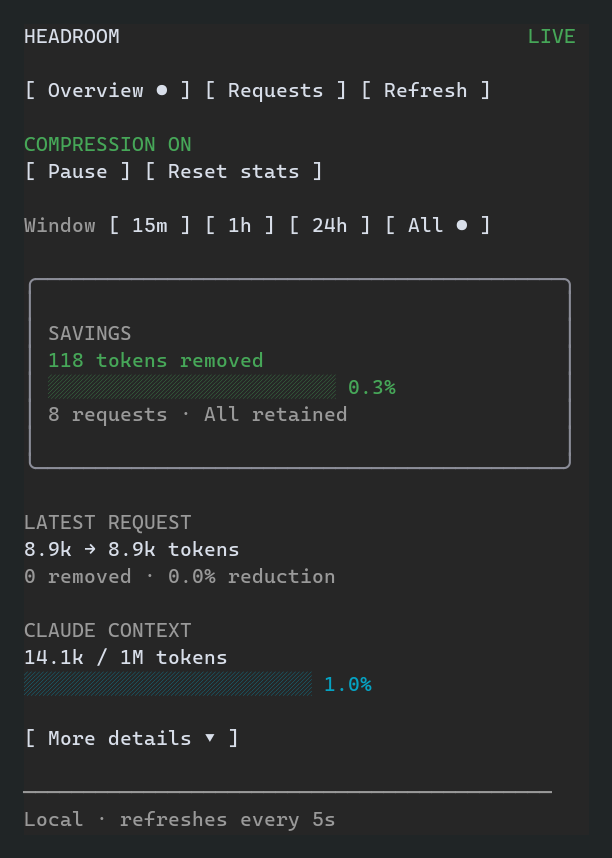

# Headroom Sidebar — Claude Code mod

**Version 0.1.3 · installable preview · local conversation controls and telemetry**

A sidebar for current-conversation Headroom compression, native Claude context usage,
retained request statistics, and on-demand before/after message review. This is a
function-hook **mod**, not a skill, status-line script, or embedded web dashboard.
Its plugin name is `headroom-sidebar`; the existing `headroom` startup-hooks plugin
is left alone. The command is `/headroom-sidebar`. When installed alongside
`headroom-snip`, Snip retains `/headroom` for its compression log.

The source includes the mod, a separately buildable Python companion wheel, an
opt-in Headroom proxy extension, a launcher, offline and native-runtime tests,
and the original design review.

## Validation status



[View paused compression and synthetic request-history screenshots](docs/screenshots/README.md).

The shipped hooks and companion pass their unit tests, real Headroom logger/guard
contracts, native Claude validation and runtime tests. A repeatable end-to-end test
starts the actual Headroom proxy, compresses a synthetic tool result, forwards it
to a local Anthropic-compatible provider, and verifies the resulting records
through the companion API and shipped sidebar hooks. It passes with capture on
and off; no API credentials or provider charges are required. Its host API is a
fixture, so it does not substitute for native Claude UI acceptance.

Authenticated native Windows Claude sessions were also exercised on Claude
2.1.290/2.1.291 and Headroom 0.40.0, including real savings, separate sessions,
message inspection, resume, `/clear`, narrow-terminal scrolling and proxy restart.
See [docs/VALIDATION.md](docs/VALIDATION.md) for reproducible commands and limits.

## Conversation controls

- **Pause compression / Resume compression** (`p`): changes actual compression
  for this conversation and children inheriting its launch header. The proxy
  confirms the state before the sidebar updates it. Paused requests use Headroom's
  existing bypass path; requests already in flight finish under their previous state.
- **Reset stats**: starts totals and the request list from now. Retained records
  remain available to the request inspector; reset does not delete logs or change
  compression. A selected time window is also limited by the most recent reset.
- **Time window**: 15 minutes, 1 hour, 24 hours, or all retained requests.
  Filtering happens before totals are computed, including records beyond the
  100-row display limit. Retention can make a selected window incomplete.
- **Progress bars**: weighted compression reduction and native
  Claude context usage. Percentages remain visible; unavailable values are marked
  explicitly, and negative reductions retain their signed percentage.
- **Overview layout**: a framed savings summary, separate latest-request and
  context sections, and an expandable **More details** (`d`) control for latency,
  cache and transform metrics. Accounting failures and retention warnings remain
  visible even when details are collapsed.

Controls are local and conversation-scoped. Closing the pane does not resume
compression. Proxy restart restores compression to on and clears reset markers;
settings do not persist across proxy restarts. Control state is bounded to 256
conversations; a full registry rejects new control registrations rather than
silently resuming a paused conversation. Existing proxy policy can still bypass
compression when the sidebar switch is on.

## Requirements

When Headroom is unavailable, choose **Start Headroom** in the sidebar. Claude's
native tool permission flow runs `headroom-mod start`, which reuses a compatible
proxy or starts one with the companion extension. Install Headroom and the
companion in the same Python environment and ensure `headroom-mod` is on PATH.
The sidebar displays an exact `headroom-mod run --resume` command for restarting
the current conversation through Headroom; an existing Claude process cannot
change its provider routing. Proxy output goes to the local Headroom sidebar
cache directory. Message capture remains off by default. Telemetry reads remain
read-only; compression and stats changes are explicit local POST actions.

Claude Code **2.1.287 or newer**, its native executable on Windows, and a Python-based
Headroom proxy with the `headroom.proxy_extension` API and retained `RequestLogger`.
The original compatibility review used Headroom main at
`a493f559a1a85a5462fc3bf3f363d64c3c9444ce`. The implementation has since been
verified with published Headroom 0.40.0 and this repository's proxy source. Request metadata logging (`log_requests`) must be enabled. The companion checks the retained-log shape and fails
closed when unsupported. Python 3.10+ is required by the companion; use the Python
version your Headroom checkout itself requires.

This first version targets **interactive, locally launched Claude Code using an
Anthropic-compatible Headroom proxy**. The host-native UI is exercised with terminal
and desktop-shaped protocol fixtures, but the launcher does not configure Claude
Desktop, remote/cloud sessions, Bedrock, Vertex, or Foundry. Those integrations need
separate attribution/transport work. Never expose these content endpoints publicly.

## Install and start

Run these commands from the extracted `headroom-claude-mod` directory.

**1. Install the companion into the SAME Python environment that runs Headroom.**
Installing it in a different virtual environment will not register the extension
with your Headroom process. The wheel does not install or upgrade Headroom.

```powershell
python -m pip install ./companion
claude --version
claude plugin validate ./plugins/headroom-sidebar
claude plugin test ./plugins/headroom-sidebar
```

For a `uv`-managed environment, use its activated Python or `uv pip install` with an
explicit `--python` path to Headroom's interpreter. For source development, the
alternative is `python -m pip install -e ./companion`.

**2. Start your Headroom proxy with the extension enabled.** Preserve your existing
provider/model/auth/profile options; the command below shows only the additional
integration and local bind. Restart an already-running proxy with this extension
rather than trying to bind a second process to its occupied port.

```powershell
headroom proxy --host 127.0.0.1 --port 8787 --proxy-extension claude_mod
```

Metrics work with capture off. To review message contents, explicitly add
`--log-messages` to that proxy command. **This makes Headroom retain sensitive
original and compressed request content under its existing logging policy.** The
mod never enables capture or changes logging settings itself. Existing capture is
bounded by Headroom's message-retention window; old snapshots may expire.

**3. In another terminal, launch a correlated Claude conversation.**

```powershell
headroom-mod doctor --proxy-url http://127.0.0.1:8787
headroom-mod run --proxy-url http://127.0.0.1:8787 --plugin-dir ./plugins/headroom-sidebar
```

The pane opens without taking keyboard focus. `/headroom-sidebar` opens/focuses it again.
Keys: `1` Overview, `2` Requests, `r` Refresh, `s` Start Headroom when offline. Close using the pane's built-in control. Use Tab/Enter or mouse
buttons for request selection, original/compressed/diff modes, and pagination.
Use Page Up/Page Down to scroll the pane when its content exceeds the visible
height; request buttons and recovery commands may be below the fold.
The selected tab has a dot beside its label. If Claude was started directly,
the plugin can open but cannot attribute proxy requests to that conversation.
The setup pane shows the conversation UUID and a command to resume it through
`headroom-mod run --resume <UUID>` after exiting Claude. Include
`--proxy-url http://127.0.0.1:<port>` before `--resume` for a custom proxy port.
On the dedicated Windows installation, use
`& "$env:USERPROFILE\.local\share\headroom-sidebar\Start-HeadroomSidebar.ps1" -Resume <UUID>`
to use its existing proxy on port 18787. Changing tabs or pressing Refresh cannot
reroute an already-running Claude process through Headroom.
When a pane cannot be placed, a compact band explains how to reopen it at a wider
window size; it yields to surveys and composes with other mods' existing band.

Add normal Claude flags after `--`:

```powershell
headroom-mod run --plugin-dir ./plugins/headroom-sidebar -- --model sonnet
```

The launcher leaves existing custom headers and credentials intact, adding only
`X-Headroom-Mod-Session`. If `ANTHROPIC_BASE_URL` already selects another upstream,
it refuses to replace it silently: configure that provider on Headroom, then
explicitly unset the conflicting client-side variable in this shell. The launcher
does not start/restart Headroom, change profiles, edit settings, or run a shell.
Windows `.cmd`/`.bat` shims are refused; use native `claude.exe`, optionally with
`--claude-executable C:\path\to\claude.exe`.

## Persistent plugin installation

Instead of supplying `--plugin-dir` each time:

```powershell
claude plugin marketplace add .
claude plugin install headroom-sidebar@headroom-mods --scope user
headroom-mod run --proxy-url http://127.0.0.1:8787
```

The marketplace adds the UI only. The companion still has to be installed and
explicitly enabled in the Headroom proxy, and conversations must use the launcher
for attribution. Keep the extracted local marketplace directory in place.

## What the numbers mean

| Readout | Definition / scope |
|---|---|
| Latest recorded request | Headroom-reported original and optimized input tokens for the latest tagged request, including explicit missing/inconsistent/failed states. |
| Reduction | Headroom's recorded `tokens_saved / before`. Provider clamping and replay debt may reduce this below the raw input-token delta. Signed expansion records remain negative. |
| Claude context | `$.session.usage().context`; no `breakdown` is requested, so the mod does not ask for token counting or model inference. |
| Retained totals | Sum over unique retained request IDs with consistent accounting and no recorded error. Not a lifetime total and not unique context tokens. |
| Weighted reduction | Sum of saved tokens divided by sum of original tokens over the same accounted requests; never an average of percentages. |
| Cache-read share | Provider-reported cache reads divided by reads + writes + uncached input for paired available records. No fabricated billing savings. |
| Transform counts | Number of accounted requests mentioning each transform. These are not summed as separate savings. |
| Compression overhead | Headroom's recorded optimization latency, not the entire provider/network request time. |

A launch includes requests from children that inherit its correlation header. It is
not a main-agent-only or individual-tool-call attribution system. Repeated request
records are deduplicated, latest record wins. Token counts are Headroom's accounting,
not an assertion that an invoice or provider tokenizer was independently audited.

## Inspecting messages

Only choosing a request retrieves any body content. “original” and “compressed”
show individual recorded messages, each with independent indices; messages can be
deleted or reordered, so equal indices do not imply a correct before/after match.
“Request diff” compares the ordered request snapshots without inventing a message
pairing. Views are plain text: no HTML, Markdown links, terminal escape sequences,
or execution of content. Raw response completions are never served.

To keep the terminal and proxy responsive, previews are bounded: 32,768 serialized
characters, bounded node/depth/string traversal, 1,400-character transport chunks,
and at most 250 lines per side for a request diff. Truncation is explicitly marked.
These views are **not lossless transcript exports**. A missing/expired capture is
reported as unavailable; it is never reconstructed by calling CCR retrieval.
Close the pane, switch away from inspection, change conversation, or end the
session to discard the selected body from the mod's host state.

## New conversations and resuming

The launcher creates one UUID and passes it to both Claude's `--session-id` and
Headroom's correlation header before Claude's SDK starts. It deliberately does
**not** use `X-Headroom-Session-Id`, which would change Headroom cache/session behavior.
The mod verifies the native `$.session.id()` before every data operation.

Resume a **stopped** session by an exact UUID:

```powershell
headroom-mod run --resume 550e8400-e29b-41d4-a716-446655440000 --plugin-dir ./plugins/headroom-sidebar
```

Replace the example UUID with your own session ID. History is still limited by
what the current proxy retains; restarting the proxy creates a new epoch.
Interactive `/clear` or switching sessions with `/resume` changes the native
session ID without rewriting the already-initialized client's header. This version
therefore clears the pane data and asks for a fresh correlated launch instead of
mislabeling old-session totals. `--continue`, forks, remote/background attachment,
print/bare/safe-mode launches and Desktop handoff are not supported by this launcher.

## Development and release gates

```powershell
node --test tests/*.test.mjs
python -m pytest -q -c companion/pyproject.toml companion/tests
python scripts/run-http-smoke.py
python scripts/validate-native.py
```

Offline development requires Node 20+, pytest, httpx, and uvicorn in addition to the
companion's dependencies. There are no npm runtime dependencies and no JavaScript
build step. The native gate deliberately fails when Claude/Headroom are absent,
rather than reporting a misleading pass. Claude writes authoritative types for
its installed build into the mod's `.claude-plugin/types/` directory.

Before release, run the native gate plus the authenticated two-conversation,
compression, capture, restart and Windows acceptance checklist in
[docs/VALIDATION.md](docs/VALIDATION.md). The reviewed architecture, integration
choices, behavior flows, and follow-on work are in
[docs/REVIEW_AND_PLAN.md](docs/REVIEW_AND_PLAN.md).

## Removal

Close Claude, disable/uninstall `headroom-sidebar@headroom-mods`, remove
`--proxy-extension claude_mod` from your proxy startup and restart it, then uninstall
`headroom-claude-mod` from the same Python environment. The existing `headroom`
startup-hooks plugin and proxy compression configuration are unchanged. Upstream
Headroom message logs, if you explicitly enabled them, follow Headroom's own
retention/deletion policy; uninstalling this mod does not delete those logs.

## Repeatable proxy E2E

In the same Python environment as Headroom and the installed companion, with
Node on PATH:

```powershell
python scripts/run-proxy-e2e.py
python scripts/run-proxy-e2e.py --no-capture
```

The harness uses temporary state and ephemeral loopback ports, shuts down its
proxy and provider, and returns nonzero on any assertion or subprocess failure.
The repository workflow runs unit, HTTP bridge, real proxy E2E, and wheel-build
checks on Linux and Windows. Native Claude test-kit checks require the supported
Claude executable and run separately via `scripts/validate-native.py`.

An optional Windows launcher is provided in `scripts/Start-HeadroomSidebar.ps1`.
Copy it into a dedicated installation directory, create a sibling `runtime`
virtual environment, and install `headroom-ai[proxy]==0.40.0` and this companion
there. Install the plugin first; then use the script with PowerShell 7. It owns
only its dedicated proxy on port 18787. `-Doctor` checks health, `-Resume UUID`
resumes a conversation, and `-CaptureMessages -RestartProxy` explicitly enables
inspection. `-RestartProxy` without capture disables message capture.
