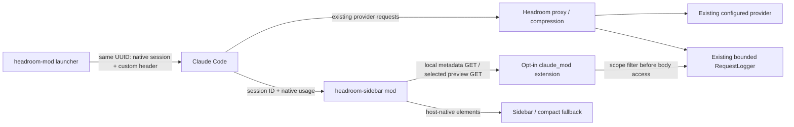

# Review and implementation plan

## Decision

Ship `headroom-sidebar` as a read-only Claude Code function-hook mod, with a
separately installed, explicitly enabled Headroom proxy extension (`claude_mod`).
Keep compression in Headroom. Do not fork its algorithms, wrap model APIs, mutate
transcripts, inject model tools, change cache behavior, or introduce a hosted service.

This document records the original design review. Current validation evidence
and remaining platform limits are in [VALIDATION.md](VALIDATION.md).

## Reviewed baseline and findings

Reviewed on October 5, 2026 (America/Chicago), against
`headroomlabs-ai/headroom@a493f559a1a85a5462fc3bf3f363d64c3c9444ce`.

The official mod tutorial, published October 1, requires Claude Code 2.1.287+.
Modules register event hooks, use host state, obtain surface-native elements through
`$.ui.resolve`, and run without Node or a DOM. The public generated API declarations
inspected in `anthropics/claude-code/mods/types/claude-code.d.ts` identify themselves
as 2.1.277; the installed build's regenerated declarations supersede that snapshot.
The built-in diff mod supplied the exact Pane `requestId`, sizing, close, and
command patterns. Sources and paths are in SOURCES.md.

Headroom already provides `/stats`, durable aggregate history, and
`/transformations/feed`. However, its “display session” is not a Claude conversation.
The transformations feed has no native session filter, omits request tags, and can
copy all recent message bodies. Its metadata-only mode helps polling, but does not
supply reliable session attribution or single-request inspection.

`RequestLog` has tags but no populated native session field. The pure `extract_tags`
helper keeps noncredential `x-headroom-*` headers, stripping the prefix. That makes
`X-Headroom-Mod-Session` available as `tags['mod-session']` without changing Headroom's
cache identity (`X-Headroom-Session-Id` has a different, existing meaning).

`RequestLogger` retains at most 10,000 metadata records and 100 message snapshots
at the inspected baseline. Therefore aggregate totals must be labeled retained,
and message expiration is a normal state. Copying the entire body window merely
to inspect one request would be wasteful and risk blocking the proxy event loop.

The stable `headroom.proxy_extension` entry point can add guarded routes without a
core patch. `app.state.proxy` is exposed before extension installation. Both
Headroom's `require_loopback` and `require_same_origin` are reused for every new route.
The extension mechanism itself is opt-in and sits inside Headroom's inbound auth
and request-body limit. One narrow private dependency remains: reading references
from `RequestLogger._logs`. It is isolated in telemetry.snapshot(), bounded, checked
at startup and on reads, and covered by a separate real-package gate.

Finally, Headroom's existing marketplace already contains a plugin called
`headroom` (startup hooks). Reusing that name could collide with or replace it.
The shipped UI plugin and host state are named `headroom-sidebar` instead.

## Architecture

No prompt or completion goes into mod-originated model requests because the mod
makes none. No service outside the local proxy is intentionally contacted by the
mod. It has no provider-auth handle, npm runtime dependency, shell invocation, disk
transcript store, or CCR retrieval side effect. Local HTTP is delegated to the
Claude host; its published HttpInit has no request abort/timeout option. The mod
adds a four-second UI deadline but keeps the single-flight lock until the underlying
host operation actually settles, preventing unbounded retries of a hung read.

## Implemented slice

The Overview shows latest-request compression, native context, retained weighted
savings, failures/unaccounted requests, optimization overhead, cache counts/share,
transform request counts, and a bounded token-saving trend. The Requests view has
paging and a changed-only filter over the newest 100 scoped retained requests.
The Inspector has independent original/compressed message navigation and a bounded
request-level unified diff. It never pretends that equal indices remain aligned
when compression removes or reorders messages.

The backend exposes versioned local health, session metadata, and selected-request
inspection routes. Metadata is allowlisted, does not contain raw tags/errors/bodies,
and is cached for two seconds in a bounded 32-session cache. Retained totals
exclude failed and inconsistent/missing token-accounting rows and deduplicate
request IDs (latest record wins). All response values have an explicit basis.

The launcher validates a literal loopback HTTP origin, checks companion identity,
preserves unrelated custom headers and credentials, refuses silently overwriting
an inherited upstream, uses argument vectors without a shell, and propagates Claude's
exit status. New/resumed conversations have deterministic correlation before SDK
initialization. It does not alter user settings or launch/restart the proxy.

## Behavior-driven flows

**New launch.** Given an opted-in compatible proxy, when the launcher starts Claude,
the same UUID is in the native session and the dedicated header. The pane opens
without focus theft, reads only that UUID's metadata and begins five-second polling.
No retained records means “no tagged requests,” not zero proxy-wide savings.

**Compression.** Given a successful accounted request, the newest row shows original,
optimized and removed tokens. The aggregate uses paired numerators/denominators;
failures and inconsistent counts are shown but not silently added to savings.
Negative savings remains visible as expansion.

**Concurrent conversations.** Given A and B share the proxy, requesting A filters
retained entries before any body is read. A cannot select B's request through A's
route. This is attribution correctness, not an authenticated multi-tenant boundary.

**Review.** Given capture is enabled and a request is retained, selecting it fetches
one bounded page. Changing side or message fetches another explicit selection.
Given capture is off/expired, the API answers unavailable with the reason. It does
not enable logging, reconstruct a message, or call CCR retrieval.

**Disconnect/restart.** A failed read marks the display offline/stale and drops the
body. A new epoch replaces totals and clears inspection instead of adding two proxy
lifetimes. Polls never overlap, and rendering itself never triggers network work.

**Close/session switch.** Closing pauses polling and drops the selected body. A late
response cannot restore it. A native session mismatch after `/clear` or a session
switch drops all prior data; relaunch is required in this first version rather
than silently keeping the old startup header.

**Installation failure.** A missing/wrong companion, malformed URL, foreign upstream,
provider-bypass environment, unsupported launch mode, or absent Claude executable
fails with a targeted error. The real native validation script fails when required
runtimes are missing; it cannot turn an unexecuted gate into green.

## Acceptance and rollout

First run the offline suite, wheel installation/doctor smoke, actual HTTP bridge,
and real Headroom logger/guard contract test. Then run `claude plugin validate` and
`claude plugin test` against the installed build. Complete the authenticated manual
checklist in VALIDATION.md, particularly parallel conversations, capture lifecycle,
real compression, interactive session changes, and terminal sizes. Windows native
execution and desktop hosting are separate gates; Linux protocol tests do not
establish those platforms' production compatibility.

The bundled patch can add this directory under `integrations/claude-code-mod` and
append the sidebar entry to Headroom's existing marketplace without replacing the
startup-hooks entry. Apply it on a feature branch, review, run repository CI, and
publish only after human approval. Nothing has been pushed or merged by this build.

## Deliberately deferred

Durable per-conversation aggregation (distinct from proxy-wide history), automatic
rebinding through `/clear` and arbitrary interactive resume, direct Desktop/cloud
startup, per-subagent/tool attribution, remote authenticated observability, and
lossless large-content exports are separate follow-on changes. Dollar savings
require provider/cache-aware billing attribution; multiplying all removed tokens
by list input price would be misleading and is not implemented.

The highest-value upstream follow-on is a public bounded RequestLogger accessor
for session-filtered metadata and a single body page. That would remove the only
private adapter dependency without changing the mod protocol or UI.
