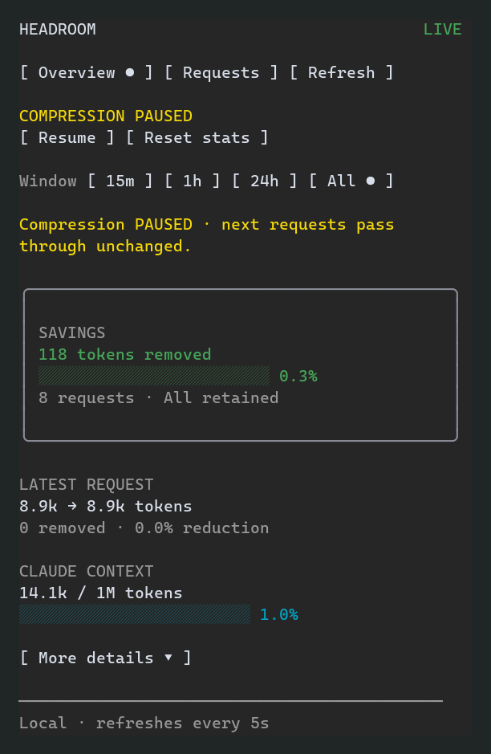
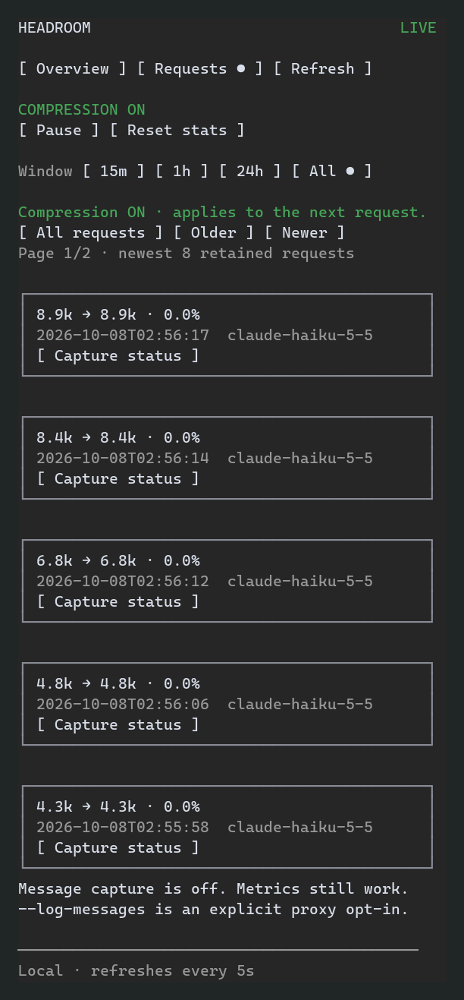

# Native sidebar demo — 0.1.3

Captured from a real Claude Code 2.1.293 / Haiku 5.5 session through Headroom on October 7, 2026. Haiku built a tiny dependency-free todo SPA in a disposable worktree using fictional fixtures and an isolated, empty MCP configuration.

These images render the session’s actual ConPTY ANSI cells, cropped to the native sidebar. Only sidebar cells are published. Account details, workspace paths, conversation text, credentials and raw logs are excluded; message capture was off. Uploaded PNGs were fetched back and verified before temporary resources were removed.

## Live overview

Eight successful retained task requests recorded 118 tokens removed from 39,524 input tokens (0.3% weighted reduction). These are retained request metrics. Context usage is shown separately. Secondary metrics are available through **More details**.

## Paused compression

Pause and resume were invoked through native keyboard controls and confirmed against the live companion.

## Request history

The adjacent `.txt` files preserve the same cropped TUI text. [Provenance](native-demo-evidence.json) records the runtime and aggregate checks without exporting a transcript.
